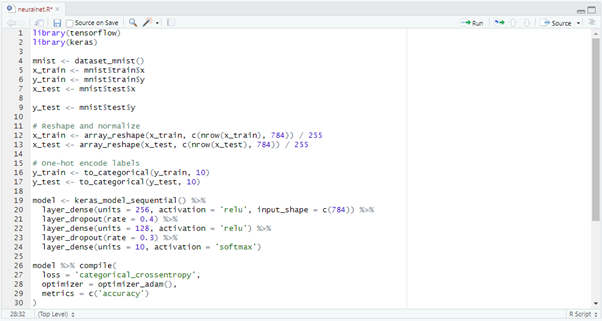
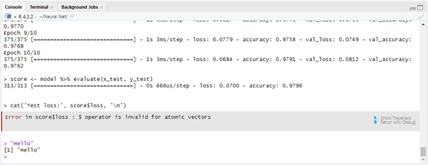
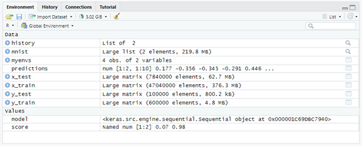
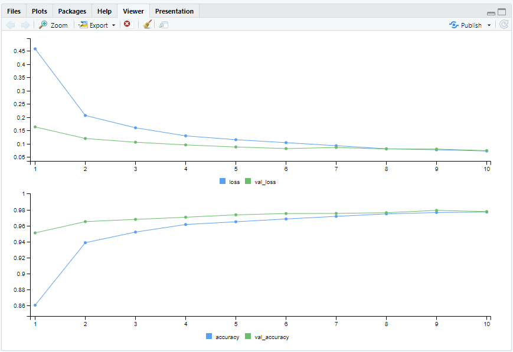
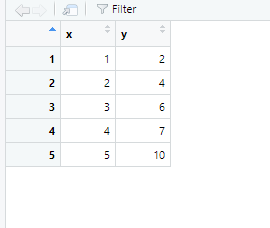
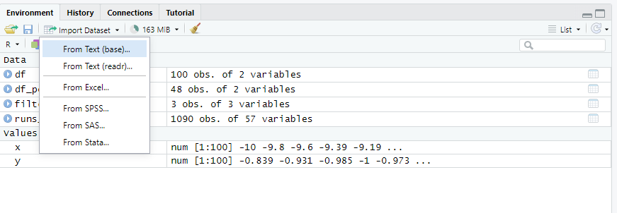
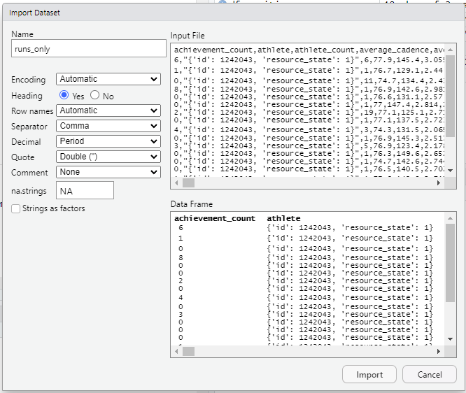
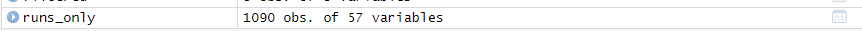
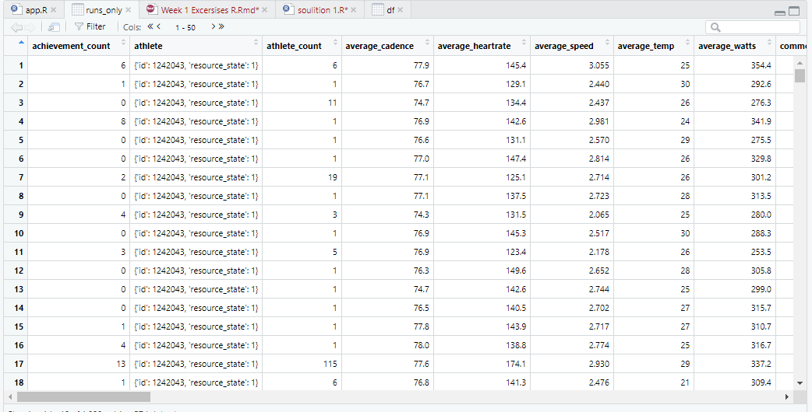

```{r setup, include=FALSE}
knitr::opts_chunk$set(echo = TRUE)
```

## Disclaimer

This series of exercises is designed to focus on helping you take your first steps in data visualisation with R using a practical approach. We will only cover basic programming techniques, so please use in conjunction with other resources, and R documentation. LLMs such as ChatGPT while very useful are not recommended, as you cannot know if the output is sensible, if you have not learnt the basics of how to use R.

## Why Choose R?

Your choice of tools should depend on:

- Industry standards in your target field, along with colleague expertise

- Your experience ie the speed of delivering solutions vs learning new tools

- Strengths and weaknesses of the toolset

### Strengths

- Built-in statistical capabilities: R was designed for statistics, with base functions for descriptive stats, regression, and data frames (originating from S). This means it also has efficient syntax for statistical analysis, often requiring less code than other languages. 

- C-Like (almost): R has some similarities with C family languages, making it more natural to move to and from these languages.

- Domain Specific language, R’s focus on statistical programming makes it highly effective for analysis and visualization. However, it works best when combined with a broader toolbox of technologies, freeing you up to choose the best tool for the job, and encouraging a more versatile skill set.

- RStudio IDE: Excellent for data exploration, plotting, variable tracking along with fantastic support for integration with Markdown, Python, JavaScript, D3, along with more.

- Standard: R has been the standard for statistical programming, this means it has extensive base functionality for statistic, along with a good selection of packages of which can be trusted to be correct.

- Publication-Quality Visualisations and Documentation: R's libraries such as markdown and ggplot2 are designed to produce high-quality customization visualisations and documentation, ensuring it is ideal for quickly creating academic or professional publications.

### Weaknesses

- AI/ML support is limited: While R offers market leading packages like Keras (a Python wrapper) and Torch for R (calling Pytorch's C++ directly), they often lag behind their Python counterparts and can sometimes be challenging to install and maintain. Older R-specific libraries (e.g., Rneuralnet) are useful for learning but unsuitable for modern deep learning. Most cutting-edge AI solutions are developed in Python, though R can integrate with Python for combined workflows.

- Networking and Web apps: R Shiny is great, but does require a Shiny Sever backed, this is not only less common than  solutions such as PHP and Node, but potentially trickier.

- Performance: A complex topic, but generally comparable to Python, although it might lag behind in certain tasks. Certainly not a performance targeted language such as Julia or C++.

- Domain Specific Language: Working in R alone will add some limitations to what you are able to produce, you will almost certainly need to learn other technologies and tools.

# Contents

There is no requirement to complete these labs for this module. They only aim to give introductions to tools that you might wish to use.

- Lab 0: Introduction and getting started.
- Lab 1: Preprocessing and creating a bar chart with plot
- Lab 2: Scatter plots with ggplot2
- Lab 3: Preprocessing with DPLYR and Visualisation with ggplotly
- Lab 4: Conditional logic and subplots with plotly
- Lab 5: Heatmaps and absolute positioning.
- Lab 6: Annotations
- Lab 7 (Intermediate): Maps
- Lab 8 (Advanced): Shiny

# Getting Started

Navigate to [R Studio](https://posit.co/download/rstudio-desktop/). Follow instructions to install the latest suitable version of R (at time of writing 4.5.1) for your environment. Then return to the link and install the latest R Studio.


This image shows a standard R view.


The script window if not already open can be opened by selecting File -> New File -> R Script. You can use the 'Run' button to run a line of code, or run the whole script with 'Source' (windows default hot keys are ctrl+shift+enter).



The console windows allows you to directly enter code. Most of the GUI operations can be also completed here. To install packages for instance you can type install.packages("your package name")



The environment window is an extremely useful tool, Here you can investigate stored data, and import data sets along with other features.


The plot window allows you to view some plots and visualisations that you create. This can be extremely handy for quick data exploration. You can also use this window for other tasks such as managing packages and viewing help documentation.

## Vectors and Dataframes

Open a new script file (or run in console)

```{r plotvector, echo=TRUE}
x <- c(1,2,3,4,5)
y <- c(2,4,6,7,10)
plot(x,y)
```

This code combines the numbers in the brackets to create vectors x and y.


The can be explored in the environment window. Allowing you to keep track of assigned variables.

plot is r's generic plotting library, we will largely not be using it for our final visualisations, but it is quick and easy to use for data exploration.

```{r dataframe, echo=TRUE}
df <- data.frame(x, y)
print(df)
```
Dataframes are an extremely useful part of r, managing two dimensional tabular data. You can print the data as above or select from the environment pane for a spreadsheet like view.


You can plot the dataframe similarly

```{r plotdataframe, echo = TRUE}
plot(df$x, df$y)
```
The dollar sign allows you to access the dataframe elements by name;

You can also use this method to do operations to the dataframe; much simpler to write than having to loop through the data.

```{r addition, echo=TRUE}
df$y <- df$y+1
df$z <- df$x+df$y
print(df)
```

Along with filtering;

```{r filtering, echo=TRUE}
filtered <- df[df$y >5,]
print(filtered)
```

ie; filtered is a new dataframe that only contains rows where y is greater than 5, it takes the format [rows,columns].

A list of operators can be found on w3schools;

[https://www.w3schools.com/r/r_operators.asp](https://www.w3schools.com/r/r_operators.asp)

## Excercises

Note: You will need to research the named functions. Avoid chatGPT, use web resources and RDocumentation.

1) Create a data frame with two columns $x$ and $y$ where $x$ has 10 values on the range -10 to 10, and $y = cos(x)$. Plot the output.

2) Use lines() to add a line to the scatter chart that goes through the points.

```{r lines, echo = TRUE}
# Example of adding a line to a plot
plot(c(1,2,3), c(4,5,6))
lines(c(1,2,3), c(4,5,6))
```

3) Use the seq() function to increase the number of x values to 100 still on the range -10 to 10.
```{r sequence}
#Example of using sequence
sequence <- seq(-1, 1, length.out = 10)
print(sequence)
```

4) Plot only positive values

5) Label axis and title chart

6) Make the scatter points blue

7) Bonus - find a method to grid lines at 2.5 intervals on the x axis.

```{r solution, echo = FALSE}
# Generate data
x <- seq(-10, 10, length.out = 100)
y <- cos(x)
df <- data.frame(x = x, y = y)

# Filter
df_positive <- df[df$y > 0, ]

#Plot
plot(df_positive$x, df_positive$y,
     main = "Cosine Curve (Positive y Values)",
     xlab = "x",
     ylab = "cos(x)",
     
     col = "blue")

lines(df_positive$x, df_positive$y)
abline(v = seq(-10, 10, by = 2.5))
abline(h = seq(0, 1, by = 0.25))

```

## Importing data

```{r importdata, echo = FALSE}
runs_only <- read.csv("~/Martins/runs_only.csv")
```

Importing data with R Studio is pretty straightforward. One method is to use the 'Import Dataset' button in the environment window.



This will provide a few options you can explore. From Text (base) provides the most basic option requiring no additional dependencies. Using Martins runs_only.csv dataset go ahead and try it out;


You'll see options for reading the file. The file is a csv type file, basically plain text (you can open in any text editor) with each column seperated by commas. Before importing you can check the windows to see if the data is being read correctly, in this case the file is very standard so you can directly then import.

You'll now see in your environment window as a dataframe;




