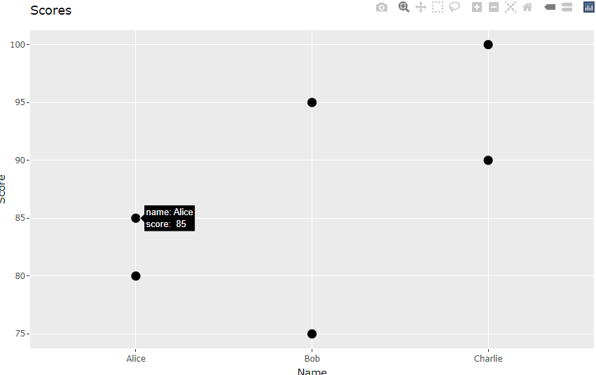
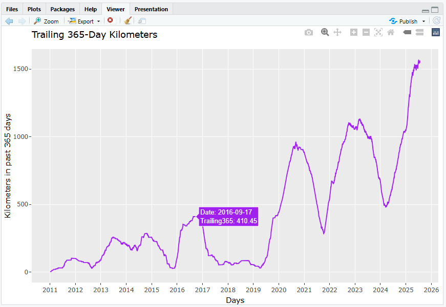

```{r setup, include=FALSE}
knitr::opts_chunk$set(echo = TRUE)
```

## GGplotly

Up to this week, we have looked at producing static plots using the Grammar of Graphics and rendering
them with ggplot2. By design, and because ggplot2 relies on R’s grid graphics system, these plots cannot
be made interactive without additional tools.
Plotly is a JavaScript library built on top of D3.js. JavaScript is the primary language used by web browsers
to add interactivity to HTML pages. Given the visual and dynamic nature of the web, JavaScript has become
an excellent tool for data visualization.
Modern web browsers, such as Chromium, can be run in lightweight modes that do not require a full
installation, making them easy to distribute. RStudio itself includes a similar rendering engine, so fortunately
can display interactive content seamlessly within its viewer pane. As we progress to creating full dashboard
we will be fully moving towards using web technologies with R

```{r installplotly, echo = TRUE, eval = FALSE}
install.packages("plotly")   # if not already installed
```

```{r ggplotly, echo = TRUE}

library(ggplot2)
library(plotly)

df <- data.frame(
  name = c("Alice", "Bob", "Charlie", "Alice", "Bob", "Charlie"),
  score = c(80, 75, 90, 85, 95, 100)
)
df

# A simple ggplot scatterplot
p <- ggplot(df, aes(x = name, y = score)) + #we assign the plot to p
  geom_point(size = 3) +
  labs(title = "Scores",
       x = "Name",
       y = "Score",
  )

# Convert ggplot to interactive plotly chart
##ggplotly(p)#Use this! I will call p only for a static chart for the pdf
p #This line should not be used.

```

If you run the above code in an R script using ggplotly(p) you will notice at first that the code is very similar to ggplot2, you should see a chart appear in the viewer pane. This chart will have automatically been rendered with labels on hover.



You find a great selection of charts you can start with;

[https://plotly.com/ggplot2/](https://plotly.com/ggplot2/)

Note: The techniques we have covered are free, open source and run completely offline in that your data is not exposed to others.

## Import data

You can import your own data, but I've included one I made earlier if you need it.

```{r eval = TRUE, echo = TRUE}

file_id <- "1lgjURcPZaIDCqBa_bjbkmZk9i12M9x9W"
url <- paste0("https://drive.google.com/uc?id=", file_id)

trailing365 <- read.csv(url)
head(trailing365)

```

## 1. Create an interactive line chart using ggplotly.

Assigning a value such as `p <- gglplot` create a `geom_line()` plot in ggplot, and render with `ggplotly(p)`. You might need to ensure the `Date` column is a time series. Note: If the time data is not prepared correctly `geom_line()` might treat the information as discrete. Setting `aes(group=1)` can sometimes force continuous behavior.

```{r echo = FALSE, eval = TRUE}
#Plot
trailing365$Date <- as.Date(trailing365$Date)
p <- ggplot(trailing365, aes(x = Date, y = Trailing365)) +
  geom_line(colour = "purple") +
  labs(
    title = "Trailing 365-Day Kilometers",
    x = "Days",
    y = "Kilometers in past 365 days"
  ) +
  scale_x_date(date_labels = "%Y", date_breaks = "1 year")
#ggplotly(p) Correct method to render.
p #This line should not be used.
```

## 2. Tidy chart

Create yearly x-axis ticks using:

`scale_x_date(date_labels = "%Y", date_breaks = "1 year")`

Explore how to change the tooltip to limit values to two decimal places.

To do this, create a new dataframe column that contains the hover text.  
`<br>` is a newline in HTML, and `sprintf("%.2f", trailing365$Trailing365)` formats the value to 2 decimal places. Hovertext will contain a mixture of r, html along with D3.js specific formating.

Some information can be found here, others can be found using the standard plotly hovertext and finally posit will likely hold some information;

[https://plotly.com/r/hover-text-and-formatting/](https://plotly.com/r/hover-text-and-formatting/)

Next, map this new column in `aes()` using:

`aes(text = hover_text)`

If the line does not draw correctly (for example, if the x-axis is treated as discrete), try adding `group = 1` inside `aes()` to force one continuous line.

Finally, render the interactive chart with:

`ggplotly(p, tooltip = "text")`

```{r echo = FALSE, eval = TRUE}
trailing365$Date <- as.Date(trailing365$Date)
trailing365$hover_text <- paste0(
  "Date: ", trailing365$Date,
  "<br>Trailing365: ", sprintf("%.2f", trailing365$Trailing365)
)

p <- ggplot(trailing365, aes(x = Date, y = Trailing365, group = 1, text = hover_text)) +
  geom_line(colour = "purple") +
  labs(title = "Trailing 365-Day Kilometers",
       x = "Days", y = "Kilometers in past 365 days") +
  scale_x_date(date_labels = "%Y", date_breaks = "1 year")
#ggplotly(p, tooltip = "text") Use this
p #This line should not be used.
```

