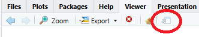
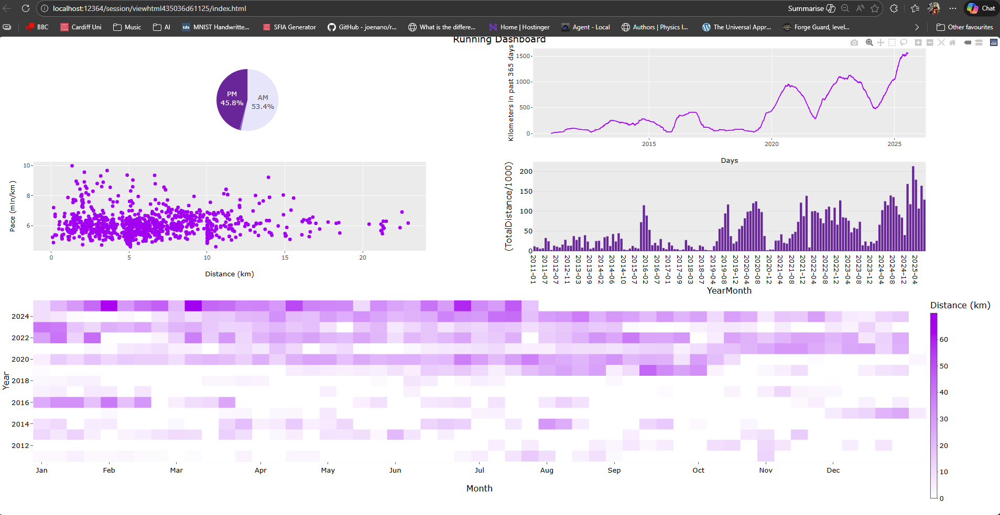

```{r setup, include=FALSE}
knitr::opts_chunk$set(
  echo = TRUE,
  message = FALSE,
  warning = FALSE
)
```

# Lab 5 Heatmaps and Positioning

## Goal

Create a calendar-style heatmap by aggregating total distance by Year and Week.

## Imports

```{r eval = TRUE, echo = TRUE}

library(dplyr)
library(plotly)
library(ggplot2)

file_id <- "1N1UERM9IGhJ29apnDalVLhx9EJBmvH-v"
url <- paste0("https://drive.google.com/uc?id=", file_id)

distancevpace <- read.csv(url)

file_id <- "1lgjURcPZaIDCqBa_bjbkmZk9i12M9x9W"
url <- paste0("https://drive.google.com/uc?id=", file_id)

trailing365 <- read.csv(url)

file_id <- "1MLylJ6cizJlTFVi_FdiF11pjpT3brlsO"
url <- paste0("https://drive.google.com/uc?id=", file_id)

monthly_stats <- read.csv(url)

file_id <- "1K-PNkRuAPaVWP_fh8iOZfJyulPvcKOff"
url <- paste0("https://drive.google.com/uc?id=", file_id)

daily_summary <- read.csv(url)

file_id <- "11J2STN0Ufiyyo1FRn-zZ0QXCW85m3YFN"
url <- paste0("https://drive.google.com/uc?id=", file_id)

weekly_sum <- read.csv(url, check.names = FALSE) # Check names prevents r from adding an 'X'
#Column names should not really be numbers.

```

```{r echo = TRUE, eval = FALSE}

ncol(matrix_df)
tail(colnames(matrix_df), 10)


```

## 1. Create heatmap.

In plotly heatmaps are as straight forward as setting `x`,`y`,`z` along with `type="heatmap". Take some time to format the hovertemplate and axis labels.

```{r echo = FALSE, eval = TRUE}

fig <- plot_ly(
  data = weekly_sum,
  x = ~Week,
  y = ~Year,
  z = ~TotalDistance,
  type = "heatmap",
  colors = colorRamp(c("white", "purple")),
  hovertemplate = paste0(
    "Year: %{y}<br>",
    "Week: %{x}<br>",
    "Distance: %{z:.2f}<extra></extra>"
  ),
  colorbar = list(
    title = "Distance (km)",
    thickness = 14
  )
) %>%
  layout(
    title = "Weekly Distance Heatmap",
    yaxis = list(title = "Year"),
    xaxis = list(
      tickmode = "array",
      tickvals = c(1, 5, 9, 14, 18, 22, 27, 31, 35, 40, 44, 48),
      ticktext = c("Jan","Feb","Mar","Apr","May","Jun","Jul","Aug","Sep","Oct","Nov","Dec"),
      title = "Month"
    )
  )

fig

```

## 2. Create dashboard

I’ve included previous weeks’ code in the appendix. Using that (or your own plots), add the heatmap to the bottom of the dashboard.

One convenient method is to nest subplots by building each row separately, then combining rows into a single figure:

> `row1 <- subplot(fig1, fig2, nrows = 1)`
>
> `row2 <- subplot(fig3, fig4, nrows = 1)`
>
> `dashboard <- subplot(row1, row2, nrows = 2)`

This approach lets you control how many charts appear in each row (for example, a heatmap can span the full width on the final row). Note that you may still need to set arguments such as `nrows`, `titleX`, and `titleY` when combining plots.

Once you have all charts in a single figure, you can start formatting. This step can be time-consuming (layout tweaks are a normal part of building dashboards). Also note that the RStudio Viewer pane is quite small, so it is often easier to open the dashboard in a web browser. You can convieniently do this from RStudio using 'show in new window'



If you experience rendering issues, try opening the output in a Chromium-based browser (Chrome or Edge), as these tend to be the best supported.



Aim to get all charts visible; we will add annotations and subplot titles in the next lab. Remember that domain-based charts (like pie charts) may need manual placement:

```{r, echo = TRUE, eval = FALSE}
  domain = list(
    x = c(0.00, 0.48),
    y = c(0.8, 0.95)
  ),
```

The x and y ranges are proportions of the available space (0 to 1), where y increases from bottom to top. In some cases you may also want to manually position the heatmap colour bar, for example:

```{r, echo = TRUE, eval = FALSE}
colorbar = list(x = 1.02, y = 0.40)
```

```{r, echo=FALSE, eval = FALSE}
#Heatmap
heat_fig <- plot_ly(
  data = weekly_sum,
  x = ~Week,
  y = ~Year,
  z = ~TotalDistance,
  type = "heatmap",
  colors = colorRamp(c("white", "purple")),
  hovertemplate = paste0(
    "Year: %{y}<br>",
    "Week: %{x}<br>",
    "Distance: %{z:.2f}<extra></extra>"
  ),
  colorbar = list(
    title = "Distance (km)",
    thickness = 14,
    x = 1,
    y = 0.4
  )
) %>%
  layout(
    title = "Weekly Distance Heatmap",
    yaxis = list(title = "Year"),
    xaxis = list(
      tickmode = "array",
      tickvals = c(1, 5, 9, 14, 18, 22, 27, 31, 35, 40, 44, 48),
      ticktext = c("Jan","Feb","Mar","Apr","May","Jun","Jul","Aug","Sep","Oct","Nov","Dec"),
      title = "Month"
    )
  )


#Pie Chart
pie_fig <- plot_ly(
  data = daily_summary,
  labels = ~AMPM,
  values = ~count,
  type = "pie",
  #Notice domain this specifies the position of the plot.
  domain = list(
    x = c(0.00, 0.48),
    y = c(0.8, 0.95)
  ),
  textinfo = "percent+label",
  textposition = "inside",
  hovertemplate = "%{label}: %{value}<extra></extra>",
  marker = list(colors = c("AM" = "#E6E6FA", "PM" = "rebeccapurple", "Both" = "mediumpurple")[daily_summary$AMPM])
)

#Trailing 365 chart
trailing365$Date <- as.Date(trailing365$Date)
trailing365$hover_text <- paste0(
  "Date: ", trailing365$Date,
  "<br>Trailing365: ", sprintf("%.2f", trailing365$Trailing365)
)

p_trailing <- ggplot(trailing365, aes(x = Date, y = Trailing365, group = 1, text = hover_text)) +
  geom_line(colour = "purple") +
  labs(title = "Trailing 365-Day Kilometers",
       x = "Days", y = "Kilometers in past 365 days")

trail_fig <- ggplotly(p_trailing, tooltip = "text")

#Pace and Distance Scatter
p_scatter <- ggplot(distancevpace, aes(x = Distance_km, y = Pace_min_km)) +
  geom_point(colour = "purple") +
  labs(
    x = "Distance (km)",
    y = "Pace (min/km)"
  )

scatter_fig <- ggplotly(p_scatter)

#Bar Chart
bar_fig <- plot_ly(
  data = monthly_stats,
  x = ~YearMonth,
  y = ~(TotalDistance / 1000),
  type = "bar",
  marker = list(color = "rebeccapurple"),
  hovertemplate = paste(
    "Month: %{x}",
    "<br>Distance: %{y:.2f} km",
    "<extra></extra>"
  )
)

# Top row (pie + trailing)
top_row <- subplot(pie_fig, trail_fig, titleX = TRUE, titleY = TRUE, nrows = 1, margin = 0.06)

# Middle row (scatter + bar)
mid_row <- subplot(scatter_fig, bar_fig, titleX = TRUE, titleY = TRUE, nrows = 1, margin = 0.06)

#Both
top_block <- subplot(top_row, mid_row, titleX = TRUE, titleY = TRUE, nrows = 2, margin = 0.06)

# Bottom row heatmap full width
bottom_row <- heat_fig

# Final dashboard
dash <- subplot(top_block, bottom_row,
                nrows = 2,
                titleX = TRUE,
                titleY = TRUE,
                heights = c(0.55, 0.45),
                margin = 0.06) %>%
  layout(title = list(text = "Running Dashboard"),
         showlegend = FALSE,
         height = 1000,
         autosize = TRUE)

dash
```

## Appendix

```{r echo = TRUE, eval = TRUE}
#Pie Chart
pie_fig <- plot_ly(
  data = daily_summary,
  labels = ~AMPM,
  values = ~count,
  type = "pie",
  #Notice domain this specifies the position of the plot.
  domain = list(
    x = c(0.00, 0.48),
    y = c(0.52, 1.00)
  ),
  textinfo = "percent+label",
  textposition = "inside",
  hovertemplate = "%{label}: %{value}<extra></extra>",
  marker = list(colors = c("AM" = "#E6E6FA", "PM" = "rebeccapurple", "Both" = "mediumpurple")[daily_summary$AMPM])
)

#Trailing 365 chart
trailing365$Date <- as.Date(trailing365$Date)
trailing365$hover_text <- paste0(
  "Date: ", trailing365$Date,
  "<br>Trailing365: ", sprintf("%.2f", trailing365$Trailing365)
)

p_trailing <- ggplot(trailing365, aes(x = Date, y = Trailing365, group = 1, text = hover_text)) +
  geom_line(colour = "purple") +
  labs(title = "Trailing 365-Day Kilometers",
       x = "Days", y = "Kilometers in past 365 days")

trail_fig <- ggplotly(p_trailing, tooltip = "text")

#Pace and Distance Scatter
p_scatter <- ggplot(distancevpace, aes(x = Distance_km, y = Pace_min_km)) +
  geom_point(colour = "purple") +
  labs(
    x = "Distance (km)",
    y = "Pace (min/km)"
  )

scatter_fig <- ggplotly(p_scatter)

#Bar Chart
bar_fig <- plot_ly(
  data = monthly_stats,
  x = ~YearMonth,
  y = ~(TotalDistance / 1000),
  type = "bar",
  marker = list(color = "rebeccapurple"),
  hovertemplate = paste(
    "Month: %{x}",
    "<br>Distance: %{y:.2f} km",
    "<extra></extra>"
  )
)
```

```{r fig.width=12, fig.height=8, echo=TRUE, eval = TRUE}

dash <- subplot(
  pie_fig, trail_fig,
  scatter_fig, bar_fig,
  nrows = 2,
  margin = 0.06,
  titleX = TRUE,
  titleY = TRUE
) %>%
  layout(title = list(text = "Running Dashboard"),showlegend = FALSE)

dash
```

