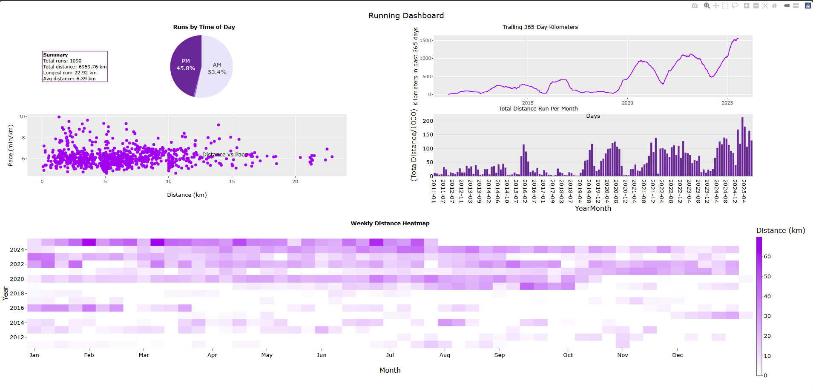

```{r setup, include=FALSE}
knitr::opts_chunk$set(
  echo = TRUE,
  message = FALSE,
  warning = FALSE
)
```

## Week 6 KPI's and Text

Goal add text to our dashboard to display key performance indicators.

As the preprossesing is fairly trivial we will include that in this notebook.

## Imports

```{r eval = TRUE, echo = TRUE}

library(dplyr)
library(plotly)
library(ggplot2)

file_id <- "1ymbNqfv9s6YGZzN93HFKAhjg0Z5xZXV1"
url <- paste0("https://drive.google.com/uc?id=", file_id)

df <- read.csv(url)

file_id <- "1N1UERM9IGhJ29apnDalVLhx9EJBmvH-v"
url <- paste0("https://drive.google.com/uc?id=", file_id)

distancevpace <- read.csv(url)

file_id <- "1lgjURcPZaIDCqBa_bjbkmZk9i12M9x9W"
url <- paste0("https://drive.google.com/uc?id=", file_id)

trailing365 <- read.csv(url)

file_id <- "1MLylJ6cizJlTFVi_FdiF11pjpT3brlsO"
url <- paste0("https://drive.google.com/uc?id=", file_id)

monthly_stats <- read.csv(url)

file_id <- "1K-PNkRuAPaVWP_fh8iOZfJyulPvcKOff"
url <- paste0("https://drive.google.com/uc?id=", file_id)

daily_summary <- read.csv(url)

file_id <- "11J2STN0Ufiyyo1FRn-zZ0QXCW85m3YFN"
url <- paste0("https://drive.google.com/uc?id=", file_id)

weekly_sum <- read.csv(url, check.names = FALSE) # Check names prevents r from adding an 'X'
#Column names should not really be numbers.

```

## 1. Create metrics

Create the following variables.

- `TotalRuns`: Total Number of runs`

- `TotalDistance`: Total Distance

- `LongestRun`: Longest Run

- `AvgDistance`: Average Distance

```{r, echo = FALSE, eval = TRUE}
TotalRuns <- nrow(df)
cat("TotalRuns:", TotalRuns, "\n")

TotalDistance <- round(sum(df$distance / 1000), 2)
cat("TotalDistance:", TotalDistance, "\n")

LongestRun <- round(max(df$distance / 1000), 2)
cat("LongestRun:", LongestRun, "\n")

AvgDistance <- round(mean(df$distance / 1000), 2)
cat("AvgDistance:", AvgDistance, "\n")
```

## 2. Visualisation

Using your own code (or the code in the appendix), add the KPI values to the dashboard. Also add subplot titles and position them appropriately.

One method of doing this is to use annotations. In the dashboard’s global layout, we can use the `annotations` argument. This should be a list of annotation objects, where each annotation is a sub-list containing options such as `text`, `x`, and `y`.

[https://plotly.com/r/text-and-annotations/](https://plotly.com/r/text-and-annotations/)

```{r, echo = TRUE, eval = FALSE}
dash <- dash %>%
  layout(
    annotations = list(
      list(
        text = "<b>Runs by Time of Day</b>",
        x = 0.24, y = 1.04,
        xref = "paper", yref = "paper",
        showarrow = FALSE,
        font = list(size = 14)
      ),
      list(
        text = "<b>Trailing 365-Day Kilometers</b>",
        x = 0.76, y = 1.04,
        xref = "paper", yref = "paper",
        showarrow = FALSE,
        font = list(size = 14)
      )
    )
  )
```



```{r echo = FALSE, eval = FALSE}
#KPI's
TotalRuns     <- nrow(df)
TotalDistance <- round(sum(df$distance / 1000), 2)
LongestRun    <- round(max(df$distance / 1000), 2)
AvgDistance   <- round(mean(df$distance / 1000), 2)

stats_text <- paste0(
  "<b>Summary</b><br>",
  "Total runs: ", TotalRuns, "<br>",
  "Total distance: ", sprintf("%.2f", TotalDistance), " km<br>",
  "Longest run: ", sprintf("%.2f", LongestRun), " km<br>",
  "Avg distance: ", sprintf("%.2f", AvgDistance), " km"
)

#Heatmap
heat_fig <- plot_ly(
  data = weekly_sum,
  x = ~Week,
  y = ~Year,
  z = ~TotalDistance,
  type = "heatmap",
  colors = colorRamp(c("white", "purple")),
  hovertemplate = paste0(
    "Year: %{y}<br>",
    "Week: %{x}<br>",
    "Distance: %{z:.2f}<extra></extra>"
  ),
  colorbar = list(
    title = "Distance (km)",
    thickness = 14,
    x = 1,
    y = 0.4
  )
) %>%
  layout(
    title = "Weekly Distance Heatmap",
    yaxis = list(title = "Year"),
    xaxis = list(
      tickmode = "array",
      tickvals = c(1, 5, 9, 14, 18, 22, 27, 31, 35, 40, 44, 48),
      ticktext = c("Jan","Feb","Mar","Apr","May","Jun","Jul","Aug","Sep","Oct","Nov","Dec"),
      title = "Month"
    )
  )

#Pie Chart
pie_fig <- plot_ly(
  data = daily_summary,
  labels = ~AMPM,
  values = ~count,
  type = "pie",
  #Notice domain this specifies the position of the plot.
  domain = list(
    x = c(0.00, 0.48),
    y = c(0.8, 1)
  ),
  textinfo = "percent+label",
  textposition = "inside",
  hovertemplate = "%{label}: %{value}<extra></extra>",
  marker = list(colors = c("AM" = "#E6E6FA", "PM" = "rebeccapurple", "Both" = "mediumpurple")[daily_summary$AMPM])
)

#Trailing 365 chart
trailing365$Date <- as.Date(trailing365$Date)
trailing365$hover_text <- paste0(
  "Date: ", trailing365$Date,
  "<br>Trailing365: ", sprintf("%.2f", trailing365$Trailing365)
)

p_trailing <- ggplot(trailing365, aes(x = Date, y = Trailing365, group = 1, text = hover_text)) +
  geom_line(colour = "purple") +
  labs(title = "Trailing 365-Day Kilometers",
       x = "Days", y = "Kilometers in past 365 days")

trail_fig <- ggplotly(p_trailing, tooltip = "text")

#Pace and Distance Scatter
p_scatter <- ggplot(distancevpace, aes(x = Distance_km, y = Pace_min_km)) +
  geom_point(colour = "purple") +
  labs(
    x = "Distance (km)",
    y = "Pace (min/km)"
  )

scatter_fig <- ggplotly(p_scatter)

#Bar Chart
bar_fig <- plot_ly(
  data = monthly_stats,
  x = ~YearMonth,
  y = ~(TotalDistance / 1000),
  type = "bar",
  marker = list(color = "rebeccapurple"),
  hovertemplate = paste(
    "Month: %{x}",
    "<br>Distance: %{y:.2f} km",
    "<extra></extra>"
  )
)

# Top row (pie + trailing)
top_row <- subplot(pie_fig, trail_fig, titleX = TRUE, titleY = TRUE, nrows = 1, margin = 0.06)

# Middle row (scatter + bar)
mid_row <- subplot(scatter_fig, bar_fig, titleX = TRUE, titleY = TRUE, nrows = 1, margin = 0.06)

#Both
top_block <- subplot(top_row, mid_row, titleX = TRUE, titleY = TRUE, nrows = 2, margin = 0.06)

# Bottom row heatmap full width
bottom_row <- heat_fig

# Final dashboard
dash <- subplot(
  top_block, bottom_row,
  nrows = 2,
  titleX = TRUE,
  titleY = TRUE,
  heights = c(0.55, 0.45),
  margin = 0.10
) %>%
  layout(
    title = list(text = "Running Dashboard"),
    showlegend = FALSE,
    height = 1000,
    autosize = TRUE,
    margin = list(t = 90),  # give space for the stats box
    annotations = list(
      list(
        text = stats_text,
        x = 0.02, y = 0.95,
        xref = "paper", yref = "paper",
        xanchor = "left", yanchor = "top",
        showarrow = FALSE,
        align = "left",
        bgcolor = "rgba(255,255,255,0.85)",
        bordercolor = "purple",
        borderwidth = 1,
        font = list(size = 12, color = "black")
      ),
      # Row 1 titles
      list(text = "<b>Runs by Time of Day<b>", x = 0.2, y = 1.04, xref="paper", yref="paper",
           showarrow=FALSE, font=list(size=14)),
      list(text = "<b>Trailing 365-Day Kilometers<b>", x = 0.76, y = 1.04, xref="paper", yref="paper",
           showarrow=FALSE, font=list(size=14)),
      
      # Row 2 titles
      list(text = "<b>Distance vs Pace<b>", x = 0.24, y = 0.78, xref="paper", yref="paper",
           showarrow=FALSE, font=list(size=14)),
      list(text = "<b>Total Distance Run Per Month<b>", x = 0.76, y = 0.78, xref="paper", yref="paper",
           showarrow=FALSE, font=list(size=14)),
      
      # Row 3 title (heatmap spans both columns)
      list(text = "<b>Weekly Distance Heatmap<b>", x = 0.50, y = 0.4, xref="paper", yref="paper",
           showarrow=FALSE, font=list(size=14))
    )
  )

dash
```

## 3. Export

You can export the whole dashboard as a html file in `export` of the viewer pane using `save as webpage`.

## Appendix

```{r echo = TRUE, eval = FALSE}
#Heatmap
heat_fig <- plot_ly(
  data = weekly_sum,
  x = ~Week,
  y = ~Year,
  z = ~TotalDistance,
  type = "heatmap",
  colors = colorRamp(c("white", "purple")),
  hovertemplate = paste0(
    "Year: %{y}<br>",
    "Week: %{x}<br>",
    "Distance: %{z:.2f}<extra></extra>"
  ),
  colorbar = list(
    title = "Distance (km)",
    thickness = 14,
    x = 1,
    y = 0.4
  )
) %>%
  layout(
    title = "Weekly Distance Heatmap",
    yaxis = list(title = "Year"),
    xaxis = list(
      tickmode = "array",
      tickvals = c(1, 5, 9, 14, 18, 22, 27, 31, 35, 40, 44, 48),
      ticktext = c("Jan","Feb","Mar","Apr","May","Jun","Jul","Aug","Sep","Oct","Nov","Dec"),
      title = "Month"
    )
  )


#Pie Chart
pie_fig <- plot_ly(
  data = daily_summary,
  labels = ~AMPM,
  values = ~count,
  type = "pie",
  #Notice domain this specifies the position of the plot.
  domain = list(
    x = c(0.00, 0.48),
    y = c(0.8, 0.95)
  ),
  textinfo = "percent+label",
  textposition = "inside",
  hovertemplate = "%{label}: %{value}<extra></extra>",
  marker = list(colors = c("AM" = "#E6E6FA", "PM" = "rebeccapurple", "Both" = "mediumpurple")[daily_summary$AMPM])
)

#Trailing 365 chart
trailing365$Date <- as.Date(trailing365$Date)
trailing365$hover_text <- paste0(
  "Date: ", trailing365$Date,
  "<br>Trailing365: ", sprintf("%.2f", trailing365$Trailing365)
)

p_trailing <- ggplot(trailing365, aes(x = Date, y = Trailing365, group = 1, text = hover_text)) +
  geom_line(colour = "purple") +
  labs(title = "Trailing 365-Day Kilometers",
       x = "Days", y = "Kilometers in past 365 days")

trail_fig <- ggplotly(p_trailing, tooltip = "text")

#Pace and Distance Scatter
p_scatter <- ggplot(distancevpace, aes(x = Distance_km, y = Pace_min_km)) +
  geom_point(colour = "purple") +
  labs(
    x = "Distance (km)",
    y = "Pace (min/km)"
  )

scatter_fig <- ggplotly(p_scatter)

#Bar Chart
bar_fig <- plot_ly(
  data = monthly_stats,
  x = ~YearMonth,
  y = ~(TotalDistance / 1000),
  type = "bar",
  marker = list(color = "rebeccapurple"),
  hovertemplate = paste(
    "Month: %{x}",
    "<br>Distance: %{y:.2f} km",
    "<extra></extra>"
  )
)

# Top row (pie + trailing)
top_row <- subplot(pie_fig, trail_fig, titleX = TRUE, titleY = TRUE, nrows = 1, margin = 0.06)

# Middle row (scatter + bar)
mid_row <- subplot(scatter_fig, bar_fig, titleX = TRUE, titleY = TRUE, nrows = 1, margin = 0.06)

#Both
top_block <- subplot(top_row, mid_row, titleX = TRUE, titleY = TRUE, nrows = 2, margin = 0.06)

# Bottom row heatmap full width
bottom_row <- heat_fig

# Final dashboard
dash <- subplot(top_block, bottom_row,
                nrows = 2,
                titleX = TRUE,
                titleY = TRUE,
                heights = c(0.55, 0.45),
                margin = 0.06) %>%
  layout(title = list(text = "Running Dashboard"),
         showlegend = FALSE,
         height = 1000,
         autosize = TRUE)

dash
```