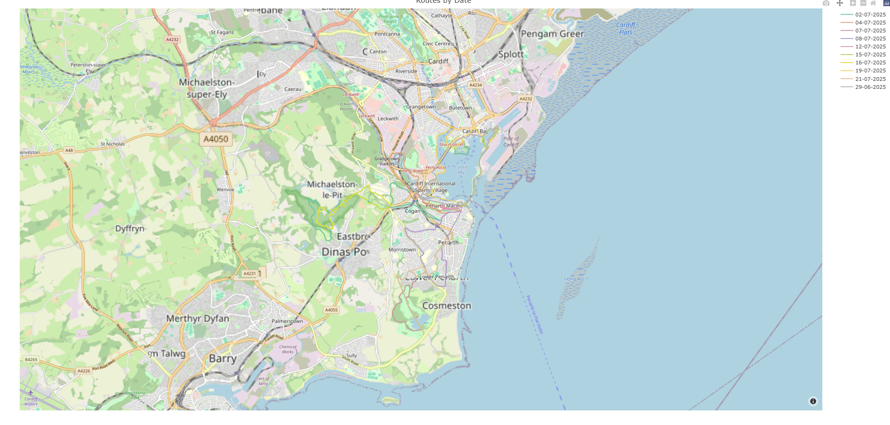

```{r setup, include=FALSE}
knitr::opts_chunk$set(
  echo = TRUE,
  message = FALSE,
  warning = FALSE
)
```

# Week 7 Visualisation with maps

Following on from the considerations in preprocessing

Can I produce a quick “first map” just to confirm things are wired up?

Can I transform my data into the required format if needed?

What’s the simplest version of this map I can plot now?

You’ll also need basemap tiles or other geographic layers to draw the map. We’ll use OpenStreetMap for its permissive licence.

>Always consider licensing and operational constraints:
>
>Licensing & cost: Is there a charge for use or redistribution?
>
>Connectivity: Can it run locally, or does it require an internet connection?
>
>Data handling: Does it send your data to a third party?
>
>Risk: Even for basic projects, assess the risks and trade-offs before you choose a source.
>
>Please note: I would not consider myself an expert in licensing and regulation, and these exercises are not intended to be used as such.

## Imports

```{r eval = TRUE, echo = TRUE}

library(plotly)

file_id <- "1PNde4IgobljN9xqDCBQjm74-cGTJ2dbJ"
url <- paste0("https://drive.google.com/uc?id=", file_id)

map_df <- read.csv(url)

head(map_df)

```

## 1. Plot the latitude and londitudes

To start to explore plotting geoline information we can simply plot our dataset on a line chart.

```{r eval = TRUE, echo = FALSE}

fig <- plot_ly(
  data = map_df,
  x = ~lon,
  y = ~lat,
  type = "scatter",
  mode = "lines",
  color = ~date
)

fig

```

### 2. Add Map Tiles

In Plotly , adding map tiles is straightforward simply add `type = scattermapbox`.

You will also need to specify a mapbox style in layout ie `layout(mapbox = list(style = "open-street-map")). In this example, we use `open-street-map`, which is free, open-source, and easy to use. This style provides the background map tiles for the visualisation.

Examples of different map styles and map-based plots can be found here:  

[https://plotly.com/r/scattermapbox/](https://plotly.com/r/scattermapbox/)

> **Recommendation:**  
> Maps can become complex very quickly. Start with a simple map and gradually add features as your understanding develops.




```{r echo = FALSE, eval = FALSE}
fig <- plot_ly(
  data = map_df,
  lon = ~lon,
  lat = ~lat,
  type = "scattermapbox",
  mode = "lines",
  color = ~date
) %>%
    layout(
    title = "Routes by Date",
    mapbox = list(
      style = "open-street-map",
      zoom = 12,
      center = list(
        lon = mean(map_df$lon),
        lat = mean(map_df$lat)
      )
    )
  )

fig
```