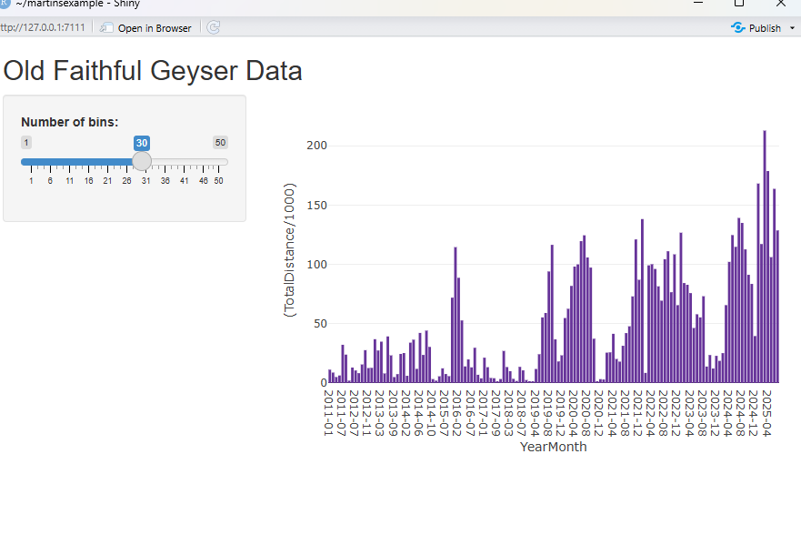
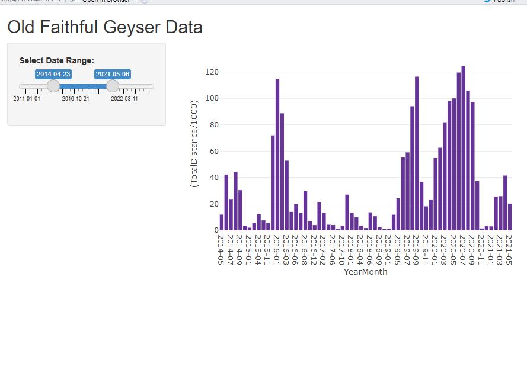

```{r setup, include=FALSE}
knitr::opts_chunk$set(echo = TRUE)
```

## Shiny

At the start of our course we saw plot and ggplot, these tools produced static charts, meaning that they could easily be used in written work. As we progressed to plotly and ggplotly we started to created plots with interactivity, ones that would need some method of interacting with, in this case a web browser or browser like engine.

The final step is essentially focusing on deployment. We have these great plots but how do we put them together and allow people to interact with them.

Enter Shiny, a framework for building interactive web apps directly in R. It’s free, open-source, and fits neatly with the tools we’ve been using. Shiny makes it fast to prototype and share results while remaining highly customisable. You can extend apps with HTML, CSS, and JavaScript, and even integrate Python where needed. Overall, it’s a straightforward way to go from R code to a working web application.

Shiny apps are relatively easy to run and share, for this course you can simply submit your R Shiny code, and include brief notes on any required packages or setup. The app can be run locally in RStudio.

> Deployment considerations: Not required for this module!
>
> We won’t cover full web development in any depth (it isn’t needed here), but a few points that should be considered for future projects:
>
> A web app typically runs on a technology stack: the server delivers HTML/CSS/JavaScript to a browser (the “client”). The server can be a physical machine or a virtual machine in the cloud; it must be running for the site to be available.
>
> Common stacks include LAMP/WAMP (Linux/Windows, Apache, MySQL, PHP), MEAN (MongoDB, Express, Angular, Node.js), and Python frameworks like Flask or Django.
>
> To deploy Shiny specifically, your stack must provide R and Shiny Server;
>
> The simplest option is shinyapps.io (Posit’s managed hosting), this is pretty straightforward, and requires no server administration but is subject to their limits and terms. Alternatively, you can install Shiny Server (also opensource) on your own Linux host or VM, but this means you do need to consider what hosts are available to you, as this is unlikely to be a more standard web hosting provision.

## Getting started

To install

```{r shiny, echo = TRUE, eval = FALSE}

install.packages("shiny")

```

In RStudio, go to File -> New File -> Shiny Web App. You’ll be prompted to name the app, choose a directory, and select a type. The type is mostly an organizational choice. For today, choose Single File (app.R) this puts both the UI (client) and server code in one file, which is perfect for simple apps and learning because everything stays in one place. For larger projects, it often makes sense to split the app into separate files (e.g., ui.R, server.R, modules) so the codebase is easier to navigate and maintain.

It will likely provide an example app, if not the code is below

```{r shinyexample, echo = TRUE, eval = FALSE}

#
# This is a Shiny web application. You can run the application by clicking
# the 'Run App' button above.
#
# Find out more about building applications with Shiny here:
#
#    https://shiny.posit.co/
#

library(shiny)
library(dplyr)

# Define UI for application that draws a histogram
ui <- fluidPage(

    # Application title
    titlePanel("Old Faithful Geyser Data"),

    # Sidebar with a slider input for number of bins 
    sidebarLayout(
        sidebarPanel(
            sliderInput("bins",
                        "Number of bins:",
                        min = 1,
                        max = 50,
                        value = 30)
        ),

        # Show a plot of the generated distribution
        mainPanel(
           plotOutput("distPlot")
        )
    )
)

# Define server logic required to draw a histogram
server <- function(input, output) {

    output$distPlot <- renderPlot({
        # generate bins based on input$bins from ui.R
        x    <- faithful[, 2]
        bins <- seq(min(x), max(x), length.out = input$bins + 1)

        # draw the histogram with the specified number of bins
        hist(x, breaks = bins, col = 'darkgray', border = 'white',
             xlab = 'Waiting time to next eruption (in mins)',
             main = 'Histogram of waiting times')
    })
}

# Run the application 
shinyApp(ui = ui, server = server)

```

Please do go ahead and test it out, run the application. You'll notice in the file there are two code blocks, 'server' and 'ui', the server block defines the chart as 'distPlot' the client simply calls it with plotOutput("distPlot"). A final step that truly makes this a dashboard is the slider. This is defined in the ui, but passed through to the server as an 'input' and is called with input$bins. There are more examples on the site.

[https://shiny.posit.co/r/gallery/](https://shiny.posit.co/r/gallery/)

## 1. Add our chart

Modify the example application to show this chart (or your own) in place of the Histogram. Primarily copy and paste appropriately into the server side code. Don't worry too much at this stage just investigate getting it working. In order to use plotly ouptuts you will need to change `plotOutput` to `plotlyOutput` and `renderPlot` to `renderPlotly`.

```{r echo = TRUE, eval = FALSE}

file_id <- "1MLylJ6cizJlTFVi_FdiF11pjpT3brlsO"
url <- paste0("https://drive.google.com/uc?id=", file_id)

monthly_stats <- read.csv(url)

#Bar Chart
bar_fig <- plot_ly(
  data = monthly_stats,
  x = ~YearMonth,
  y = ~(TotalDistance / 1000),
  type = "bar",
  marker = list(color = "rebeccapurple"),
  hovertemplate = paste(
    "Month: %{x}",
    "<br>Distance: %{y:.2f} km",
    "<extra></extra>"
  )
)
```


## 2. Connect the slider

We can now make the chart react to the date slider.

### In the UI

- Create a proper `Date` column (e.g. `YearMonthDate`) so Shiny treats the slider as a date slider.
- Use this `Date` column to set `min`, `max`, and `value` (the initial range). If these are `Date` objects, Shiny will automatically render a date slider.
- Take note of the slider `id` (the first argument in `sliderInput()`), e.g. `"date_range"`.

### In the server

- Read the slider values using `input$date_range`. This returns a vector of two dates:
  - `input$date_range[1]` is the start date
  - `input$date_range[2]` is the end date
- Filter the dataset using these two values to create a new data frame.
- Pass the filtered data frame into `plot_ly()` so the plot updates when the slider changes.


